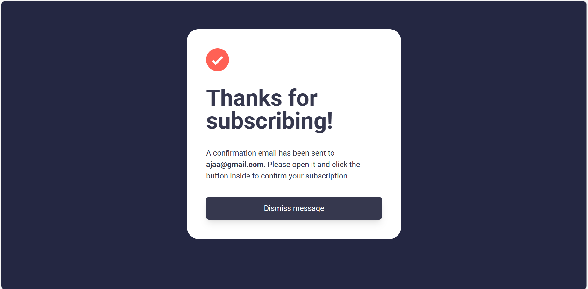

# Frontend Mentor - Newsletter sign-up form with success message solution

This is a solution to the [Newsletter sign-up form with success message challenge on Frontend Mentor](https://www.frontendmentor.io/challenges/newsletter-signup-form-with-success-message-3FC1AZbNrv). Frontend Mentor challenges help you improve your coding skills by building realistic projects.

## Table of contents

- [Overview](#overview)
  - [The challenge](#the-challenge)
  - [Screenshot](#screenshot)
  - [Links](#links)
- [My process](#my-process)

  - [Built with](#built-with)
  - [What I learned](#what-i-learned)
  - [Useful resources](#useful-resources)

- [Author](#author)

## Overview

### The challenge

Users should be able to:

- Add their email and submit the form
- See a success message with their email after successfully submitting the form
- See form validation messages if:
  - The field is left empty
  - The email address is not formatted correctly
- View the optimal layout for the interface depending on their device's screen size
- See hover and focus states for all interactive elements on the page

### Screenshot

![]
![]
![]
![]

### Links

- Solution URL: [https://www.frontendmentor.io/solutions/newsletter-signup-form-with-success-message-using-tailwindcss-js-BtYiU79SwD]
- Live Site URL: [https://fmentor-newsleter-signup.vercel.app/]

## My process

### Built with

- Semantic HTML5 markup
- TailwindCSS - Css framework
- Vanilla Javascript

### What I learned

Throughout the course of this project, I understood alot more about email validation which made me to deep further and study password validation. I also learnt using click events listeners to hide and show the customized modal screen

### Useful resources

- [resource 1](https://www.rapidtables.com/code/text/unicode-characters.html) - This helped in getting unicodes for symbols (checkmarks, cancel etc). I fully recommend it to any one still finding it difficult to get the correct unicode combination for symbols or icons

## Author

- Frontend Mentor - [@abteck](https://www.frontendmentor.io/profile/abteck)
- Twitter - [@abteck2](https://www.twitter.com/abteck2)

```

```
